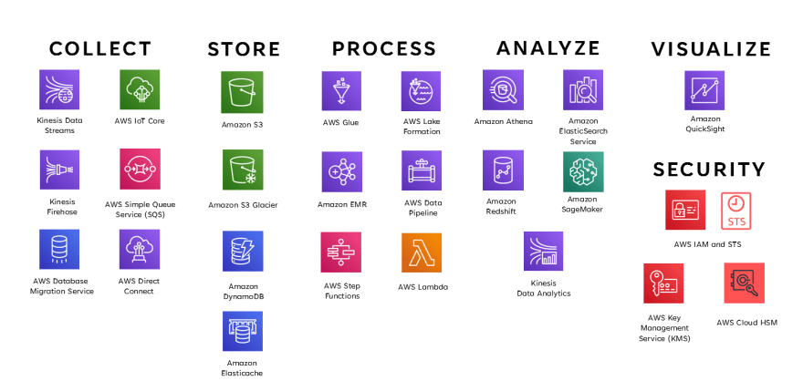
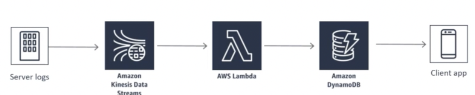
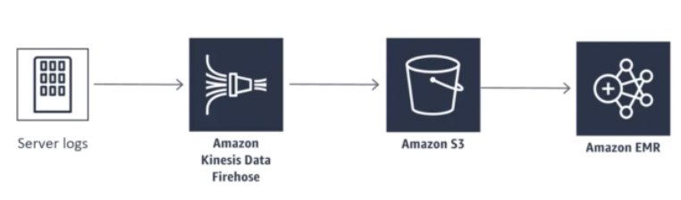
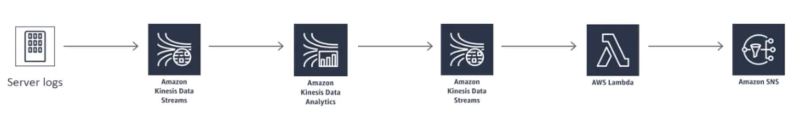
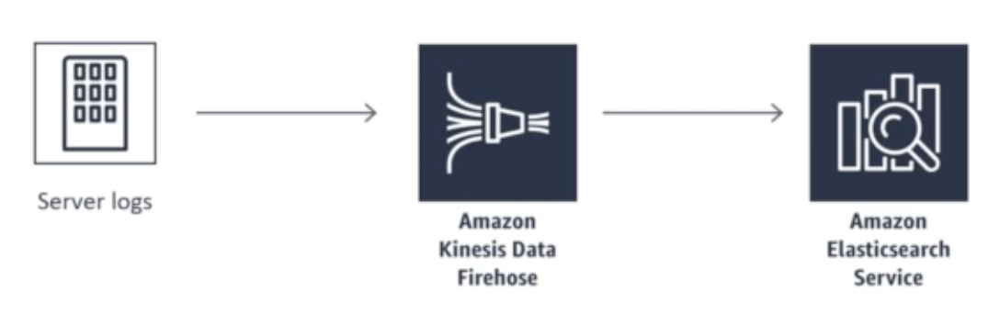
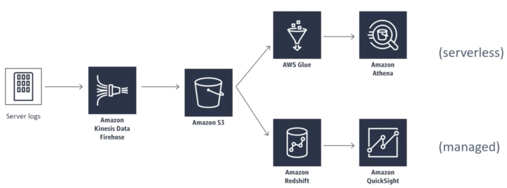
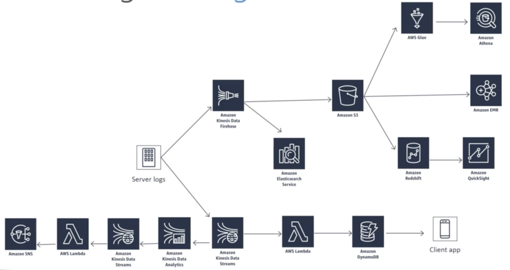

# AWS 서비스 소개 및 Usecase

# 1. 데이터 분석과 관련이 있는 AWS 서비스 

데이터 수집, 저장, 처리, 분석, 시각화와 관련하여 AWS에서는 다양한 서비스를 제공

1. **데이터 수집:**
   - **Amazon Kinesis:** 대규모 데이터 스트림을 실시간으로 수집하고 처리하는 서비스입니다. 데이터 스트림을 수집하여 실시간 분석이나 다양한 애플리케이션에 활용할 수 있습니다.

2. **데이터 저장:**
   - **Amazon S3 (Simple Storage Service):** 안전하고 확장 가능한 객체 스토리지로, 대용량의 데이터를 저장하는 데 사용됩니다.
   - **Amazon DynamoDB:** 완전 관리형 NoSQL 데이터베이스 서비스로, 빠르고 예측 가능한 성능으로 대규모 애플리케이션의 데이터를 저장합니다.

3. **데이터 처리:**
   - **Amazon EMR (Elastic MapReduce):** 대규모 데이터 세트를 분산 처리하는 데 사용되며, Apache Spark, Apache Hadoop 등 다양한 오픈 소스 프레임워크를 지원합니다.
   - **AWS Glue:** 완전 관리형 데이터 준비 및 이동 서비스로, 데이터를 추출, 변환, 로드(ETL)하여 분석에 사용할 수 있게 합니다.
   - **Amazon Lambda**: 서버리스 컴퓨팅을 제공하는 서비스로, 코드를 실행하고 관리할 필요 없이 이벤트에 응답하는 기능을 제공합니다.
   - **Amazon Kinesis Firehose**는 스트리밍 데이터를 AWS의 다양한 서비스로 간편하게 전달할 수 있도록 해주는 완전 관리형 서비스입니다. Kinesis Firehose를 사용하면 실시간으로 발생하는 데이터를 수집하고, 원하는 대상 서비스로 전송하고 저장할 수 있습니다.
        - 스트리밍 데이터 수집
        - 원하는 대상 서비스로 전송
        - 실시간 변환 및 압축
        - 완전 관리형 서비스(인프라 관리 걱정 X)
        - 확장성과 탄력성
    - **Amazon Athena**:
        - Amazon Athena는 서버리스 기반의 대화형 쿼리 서비스로, 저장된 데이터를 SQL 쿼리를 사용하여 분석할 수 있게 해줍니다.
        - Athena는 데이터를 S3에 저장하고, 필요할 때마다 SQL 쿼리를 사용하여 데이터에 대한 질문을 수행할 수 있습니다. 별도의 데이터베이스나 서버 설정 없이 사용 가능합니다.
        - 쿼리를 실행한 만큼 비용을 지불하므로, 사용량에 따라 효율적으로 비용을 관리할 수 있습니다.

4. **데이터 분석:**
   - **Amazon Redshift:** 완전 관리형 데이터 웨어하우스 서비스로, 대규모의 데이터 집합을 분석하고 비즈니스 인텔리전스를 얻을 수 있습니다.
   - **Amazon Athena:** 서버 없이 SQL 쿼리를 실행하여 데이터를 분석할 수 있는 서비스로, S3에 저장된 데이터를 쉽게 분석할 수 있습니다.

5. **데이터 시각화:**
   - **Amazon QuickSight:** 비즈니스 인텔리전스 도구로, 데이터를 시각적으로 분석하고 대화형 대시보드를 생성할 수 있습니다.

6. **기타**
    - **Amazon Elasticsearch**: 검색 및 분석을 위한 분산형 검색 및 데이터 시각화 서비스입니다. Elasticsearch는 오픈 소스의 검색 및 분석 엔진으로, 대용량의 데이터를 신속하게 색인화하고 검색할 수 있도록 설계되어 있습니다. Amazon Elasticsearch를 사용하면 손쉽게 확장 가능한 검색 솔루션을 구축하고 다양한 유형의 데이터에 대한 복잡한 쿼리를 수행할 수 있습니다.

# 2. Usecase

## 2.1. cadabra.com
- 요구사항 별 AWS 서비스 조합
1. 모바일 앱에 주문 기록 기능 제공할 것

    

        
    

    - 대용량 데이터 스트림 처리를 위해 Kinesis 사용, 람다에 기능 게시, 주문 데이터를 DaynamoDB에 적재
2. 머신러닝 기반 모델로부터 고객에게 상품을 추천할 것

    

        
    

    - 키네시스 파이어호스로 주문 데이터를 받아서 S3에 데이터 적재하고 스파크(EMR)로 처리
    
3. 예상치 못한 주문에 대해 알람 기능 추가, 언제 이상 이벤트가 발생할지 모르니 실시간 적용 필요

    

        
    

    - 키네시스 데이터 스트림과 키네시스 데이터 애널리틱스로 주문 모니터링하고 람다를 이용해 AWS SNS가 휴대폰에 알람을 보내도록 만듦

4. 거의 실시간 로그 분석

    

        
    

    - 엘라스틱서치를 이용해 주문 데이터 로그를 대시보드를 통해 확인 

5. 데이터 웨어하우징 & 시각화

    

        
    

    - Glue와 Athena를 이용해 데이터 ETL -> warehousing

### 위 내용 종합

    

