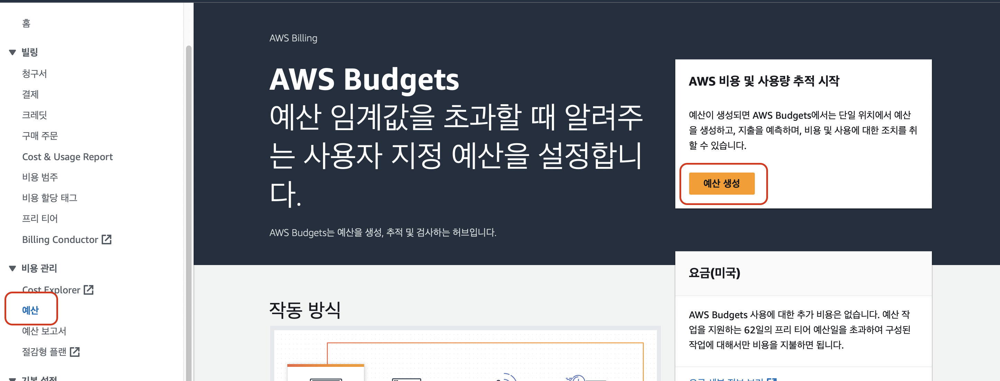
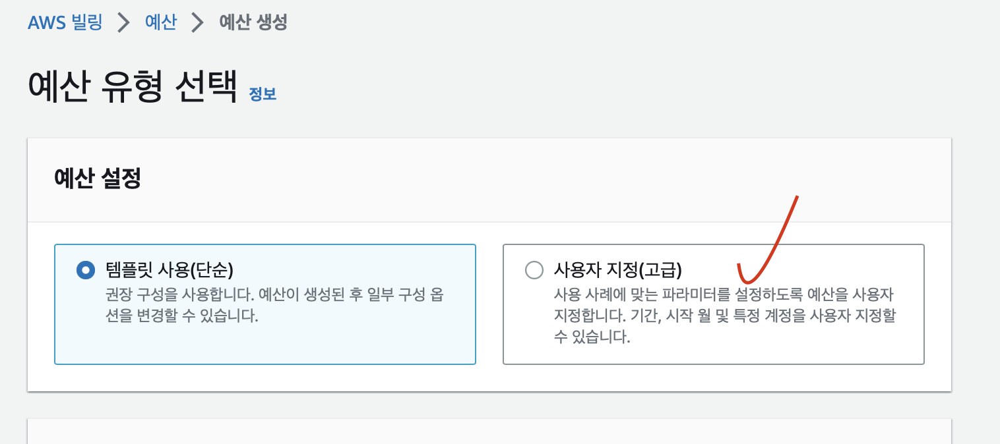
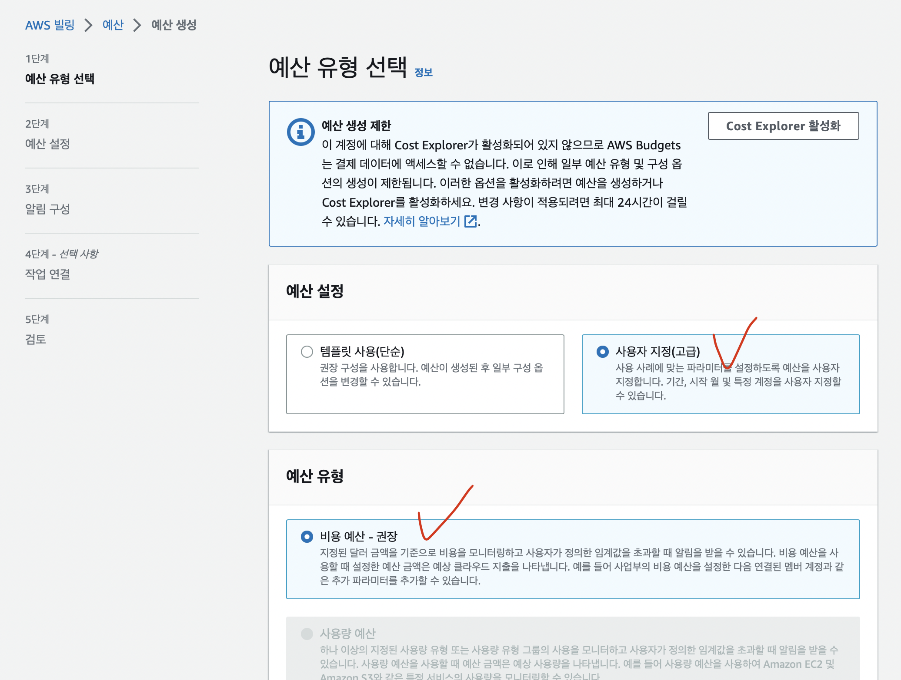
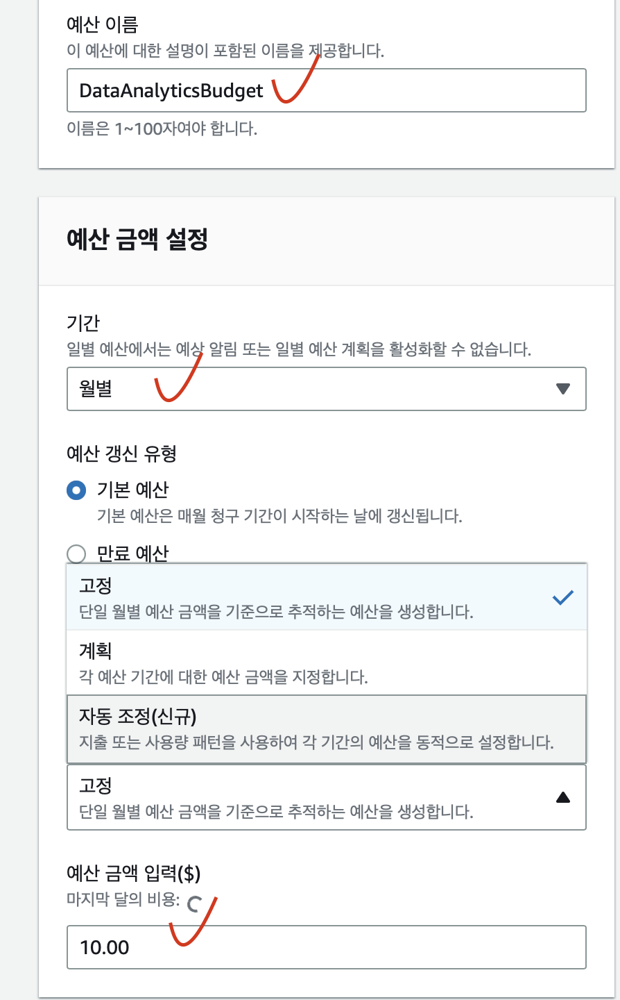
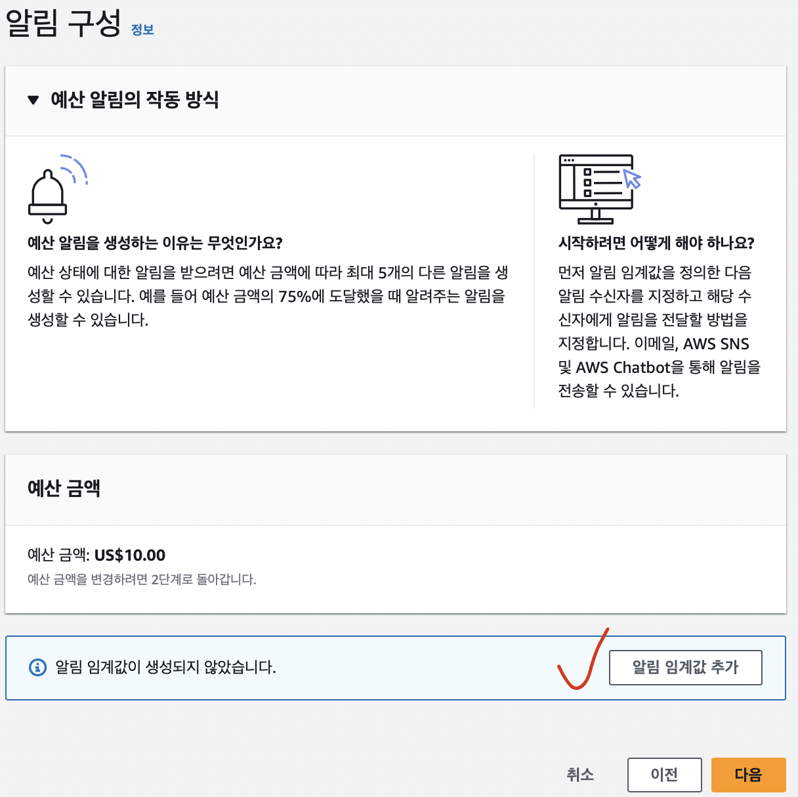
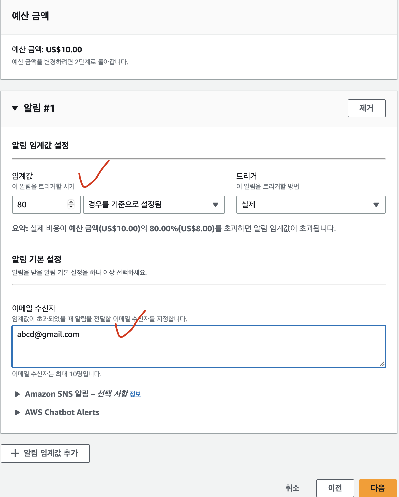
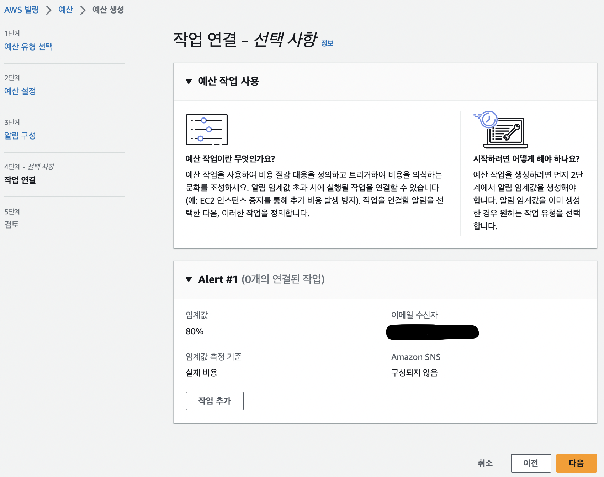
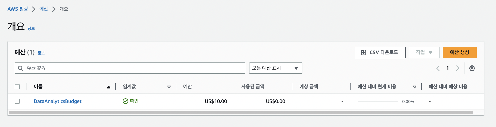

1. 예산 페이지 접속
- AWS 페이지 > budget > 예산생성하기(create budget)
    

        
    

2. 예산 유형 선택
- 사용자 지정(고급) 옵션을 선택
    

        
    

- 고급 옵션을 선택 후 예산 설정 & 예산 유형 설정
    - 특정 기간 특정 금액을 예산으로 사용하고 싶으면 비용 예산 설정  
    ex. 월 $10까지만 사용
    

        
    

3. 예산 설정
- 예산 이름과 기간, 금액 설정
    

        
    

- 예산 범위는 모든 aws 서비스 선택함

4. 예산 사용량 알람 설정
- 알람 임계값 추가 클릭
    

        
    

- 총 예산 대비 알람 사용량 기준 설정  
    ex. 총 예산 $10 대비 80% 사용 시 메일 알람
    

        
    

5. 추가 작업 선택
- 추가 작업이 필요하면 작업 추가, 아니면 다음 > 예산 생성
    

        
    

6. 예산 생성 완료
    - 아래와 같이 예산 생성이 완료됨, 예산을 일정량 이상 사용시 이메일로 알람 메세지가 전송될 것이다.
    

        
    
    