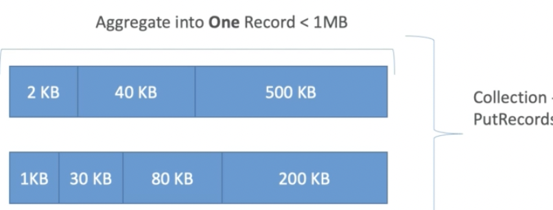
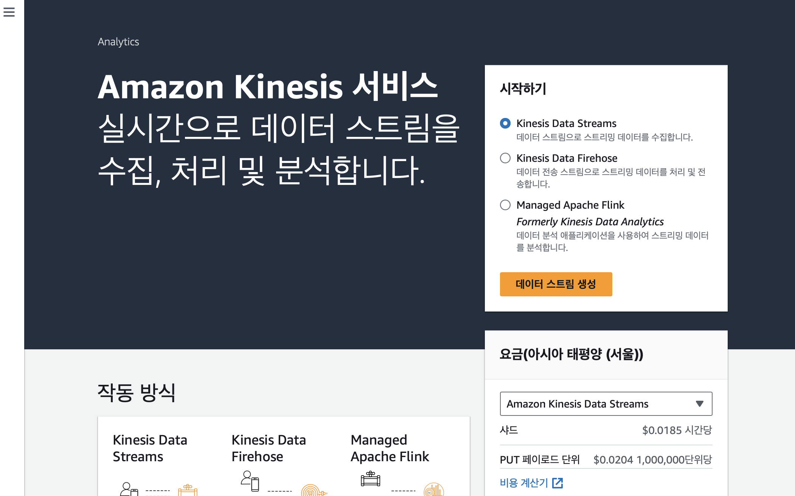
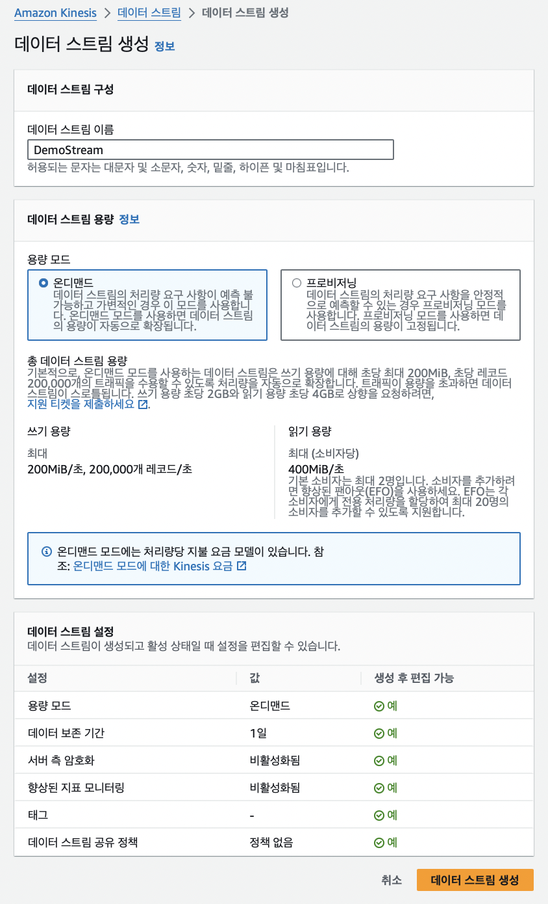
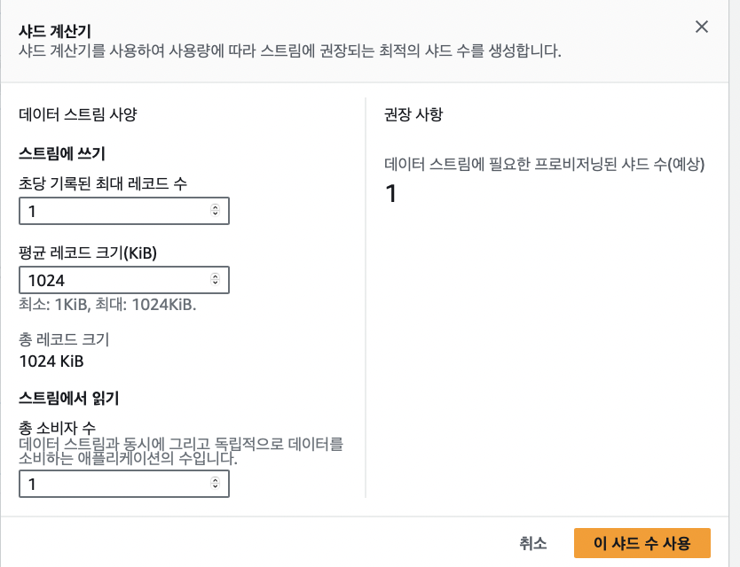
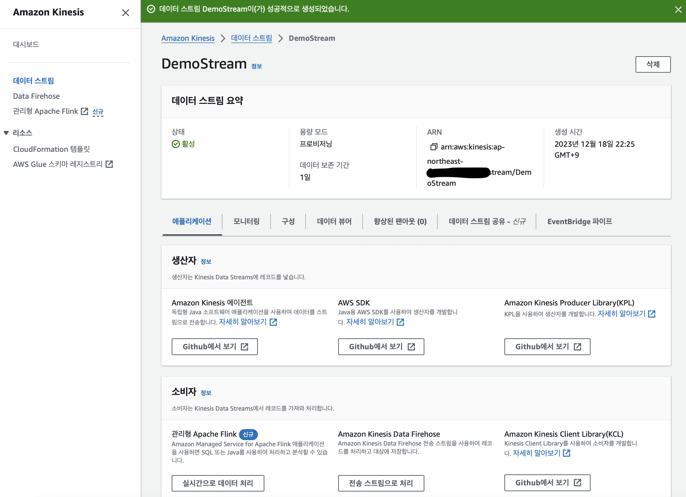
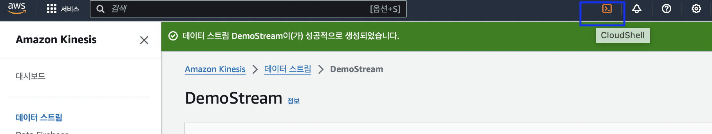
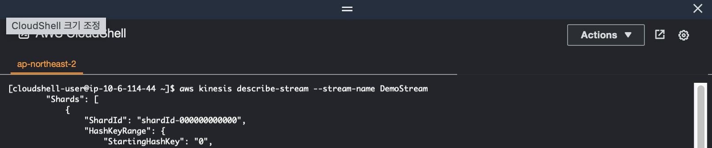
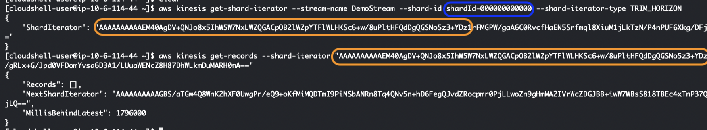

# Kinesis Data Stream 요소들

# I. Kinesis Producers

- 데이터를 보내는 방법
    - Kinesis SDK: 코드를 써서 KDS로 데이터 직접 전송
    - Kinesis Producer Library(KPL): 더 나은 코드 작성 가능, 고급 기능
    - Kinesis Agent: 서버에서 실행되는 리눅스 프로그램, 로그 파일 확보 가능
    - 제 3의 라이브러리: Spark, Log4J, Appenders, Flume, Kafka Connect, Nifi 등


## 1. Kinesis SDK - PutRecords
- 배치를 통해 처리량 늘림 -> HTTP 요청 줄어듦
- 처리량 초과시 대처: **ProvisionedTroughputExceeded**
    - Mb 또는 레코드 수 초과
    - hot shard 체크(파티션 키가 잘못되거나 너무 많은 데이터가 파티션으로 감)
        - 핫 파티션이 되지 않도록 키를 많이 배포
    - 해결방법
        - 2~4초 후 재시도
        - 샤드(스케일) 양 늘림
        - 파티션 키가 좋은 것인지 체크
- 사용 범용성: 모바일 장치에서도 사용가능(안드로이드, iOS 등)
- 사용 사례: 낮은 처리량, 지연 높음, 단순 API, AWS Lambda

## 2. Kinesis Producer Library(KPL)

- C++ or Java 라이브러리
- 고기능의 장기 프로듀서를 만들 때 사용, 자동화 기능 탑재
- 처리량 초과 상황(exception) 시 자동으로 처리 결정
- (더 나은 성능) Synchronous or Asyncrhronous API
- CloudWatch에 모니터링 지표 보냄
- 배치: 처리량은 늘리고 비용은 감소
    - collect: API 호출에 따라 여러 레코드 수집 & 여러 shard 작성
    - aggregate(increased latency): 한 레코드에 여러 레코드 저장 가능
- 압축은 유저가 직접 구현
- CLI로 읽을 수 없음, 읽으려면 KCL이나 특수 라이브러리 필요

## 3. Kinesis Producer Library(KPL) Batching

<div style="text-align:center;">
    
</div>

- 키네시스에 7개의 레코드를 보내는데 aggregation & collection 통해 API 콜만 하면 됨
- 지연시간 & 배치 수 간 조절: ex. latency 줄이고 batch 수 늘림, 또는 그 반대

## 4. KPL 라이브러리를 사용하지 않는 경우

- KPL이 RecordMaxBufferedTime를 야기할 때(프로세싱이 지연되어 최대 버퍼링 타임 초과 시)
    - 긴 지연시간을 감수하는 대신 전송되는 데이터에 많은 packing이 포함 -> 효율 & 성능 높음
    - 지연 시간을 허용하지 않는 app의 경우, AWS SDK를 이용해서 PutRecords를 통해 (나머지 데이터는 버리고) 최신 데이터만 선택 해 KDS로 보내도록 함

## 5. Kinesis Agent

- 로그 파일을 모니터링하고 KDS에 데이터를 보냄
- Java 기반 에이전트, KPL 라이브러리 위에 구현됨
- 리눅스 기반 환경에만 설치
- 특징
    - 다양한 디렉토리로부터 작성 가능, 여러 스트림에 작성 가능
    - 디렉토리/로그파일 기반 라우팅
    - 스트림으로 보내기 전에 사전 처리 가능(csv -> json, log -> json 등)
    - CloudWatch에 모니터링 지표 보냄

# II. Kinesis Consumers

- 전형적인(classic) 컨슈머(전송되는 데이터를 처리하는 주체) 종류 <br/> 
    usecase에 따라 적합한 데이터 읽기 방법을 선택하자.
    - Kinesis SDK
    - Kinesis Clent Libraray
    - Kinesis Connector Library
    - 3rd party libraries: Spark, Log4J Appenders, Flue, Kafka 등
    - Kinesis Firehose
    - AWS Lambda

- GetRecords
    - Classic Kinesis: consumer가 shard(데이터 조각)로부터 기록을 polling
        - 참고. 폴링(polling)이란 하나의 장치(또는 프로그램)가 충돌 회피 또는 동기화 처리 등을 목적으로 다른 장치(또는 프로그램)의 상태를 주기적으로 검사하여 일정한 조건을 만족할 때 송수신 등의 자료처리를 하는 방식
    - 각 shard는 집계된 2MB 산출물을 포함 
    - [ PRODUCER ] -> (SHARD_1, SHARD_2, ..., SHARD_N) GetRecords()<->Data  [ Consumer ]
        - 컨슈머가 shard에 API를 호출하면 shard는 데이터를 제공 -> 이를 polling 메커니즘이라 부름
        - GetRecords는 10MB(or 10000 records)까지 데이터를 반환
        - (중요) 5 GetRecords API 호출 당 200ms 지연 발생 <br/>
        -> 5 consumer가 존재하면 consumer 당 400KB/s 이하로 데이터를 poll할 수 있음, 즉 소비자가 많아질수록 처리량 감소

- Kinesis Client Library
    - 자바 기반 라이브러리이나 Golang, python, ruby, node 등에도 있음
    - KPL로 키네시스로부터 기록을 읽기(de-aggregation)
    - 다중 컨슈머와 다중 shard 공유
    - 체크포인트 기능 있음
    - coordination & 체크포인트에 DynamoDB 이용(데이터 스트리밍 상황 모니터링)
        - (a) WCU/RCU 기반 스트리밍 조정하거나 <br/>(b) on-demand 방식(필요시에만 처리)으로 처리하거나 <br/>(c) KCL 속도를 낮춤
        - 참고: DynamoDB에서는 사용량 만큼 지불, 이 때 단위로 쓰기, 읽기 처리량 단위를 WCU(Write Capacity Unit), RCU(Read Capacity Unit)라 함
        - "ExpiredIteratorException" 사용하려면 WCU 늘려야 함

- Kinesis Connector Library
    - 옛날 자바 라이브러리로 KCL 라이브러리 사용, EC2에서 실행
    - S2, DynamoDB, Redshfit, OpenSearch에서 데이터 write에 사용
    - 여전히 redshift에서 사용하지만, Kinesis Firehose에서는 람다로 대체

- AWS Lambda 
    - 키네시스 데이터 스트림에서 데이터 읽기 가능
    - KPL로부터의 기록을 de-aggregate하는 라이브러리 있음
    - 경량화된 ETL 실행 가능(S3, DynamoDB, Redshift, OpenSearch 등으로 데이터 전송 가능)
    - 실시간 알림을 보내는 데 사용 가능
    - 처리량 조절 가능(배치 사이즈 조정)

# III. Kinesis Data Stream

- AWS 페이지에서 kinesis를 검색하면 실시간 데이터 처리가 가능한 kinesis 페이지가 나온다.
    <div style="text-align:center;">
        
    </div>
    
    - 오른쪽 하단에 샤드 당 가격과 데이터 전송 당 가격(PUT 페이로드 단위)을 알 수 있음
    - 주황색으로 쓰여진 "데이터 스트림 생성" 클릭

- 옵션 선택
    - 데이터 스트림 이름을 설정하고 용량 모드를 설정, On-demand는 자동으로 wirte, read 용량을 설정

        <div style="text-align:center;">
            
        </div>

    - provisioning 용량 모드의 경우 데이터 읽기, 쓰기양에 따라 필요한 샤드수를 계산해 줌

        <div style="text-align:center;">
            
        </div>
    
    - 용량 모드까지 설정 후 주황색 버튼 "데이터 스트림 생성" 클릭

- 다음과 같이 데이터 스트리밍을 위한 키네시스가 생성됨, Producer & Consumer를 확인할 수 있음

    <div style="text-align:center;">
        
    </div>

- CLI 사용하기: 오른쪽 상단에 cloud shell 버튼을 누르면 CLI 사용 가능
    <div style="text-align:center;">
        
    </div>

    - CLI 배시에서 스트림 정보 확인

        ```bash
        aws kinesis describe-stream --stream-name DemoStream
        ```
        <div style="text-align:center;">
            
        </div>
    - 특정 샤드에서 낮은 용량을 사용하게 하려면 샤드명을 지정해야 함
    - TRIM-HORIZON 타입은 보내진 데이터를 처음부터 읽는 옵션

       ```bash
       aws kinesis get-shard-iterator --stream-name DemoStream --shard-id shardId-000000000000 --shard-iterator-type TRIM_HORIZON
       ```
    - 위 명령어에서 알게된 iterator 명을 아래 <> 자리에 넣는다. 컨슈머를 공유한다. (여기는 잘 이해 안됨...)
        ```bash
        aws kinesis get-records --shard-iterator<>
        ```

        <div style="text-align:center;">
            
        </div>